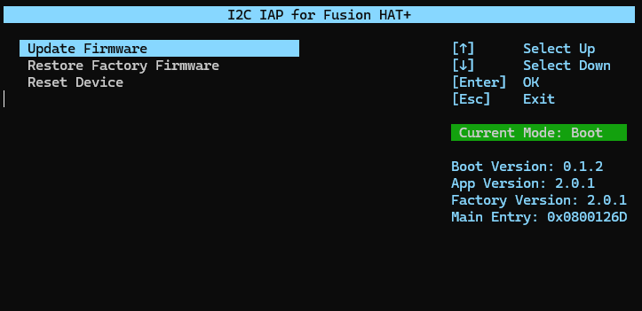

# rpi_fusion_hat_update_tools
Firmware update tools for Fusion HAT+

<p>
 
</p>

## Install depencies

```
git clone https://github.com/sunfounder/rpi_fusion_hat_update_tools.git --depth 1

sudo pip3 install blessed --break
sudo pip3 install smbus2 --break

```

## Usage

1. Stop fusion-hat-safe-shutdown Service (If you have runned fusion-hat-safe-shutdown service)
```
sudo systemctl stop fusion-hat-safe-shutdown.service
```
2. get update file
```
cd rpi_fusion_hat_update_tools
git pull
```
3. run
```
python3 run.py
```

